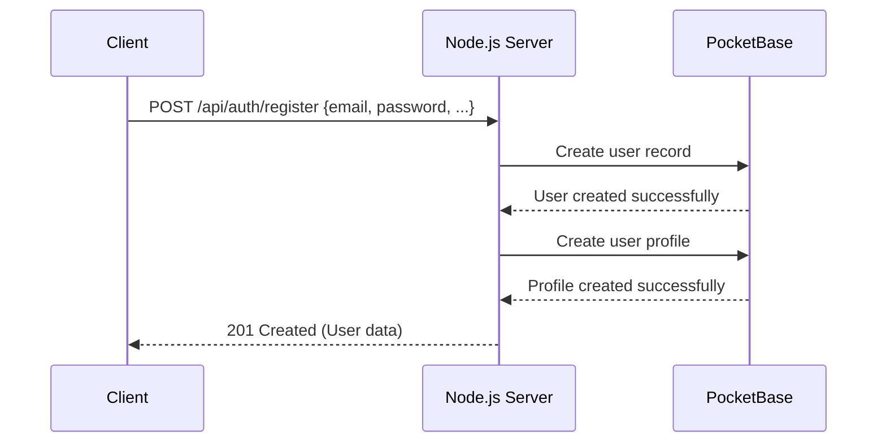
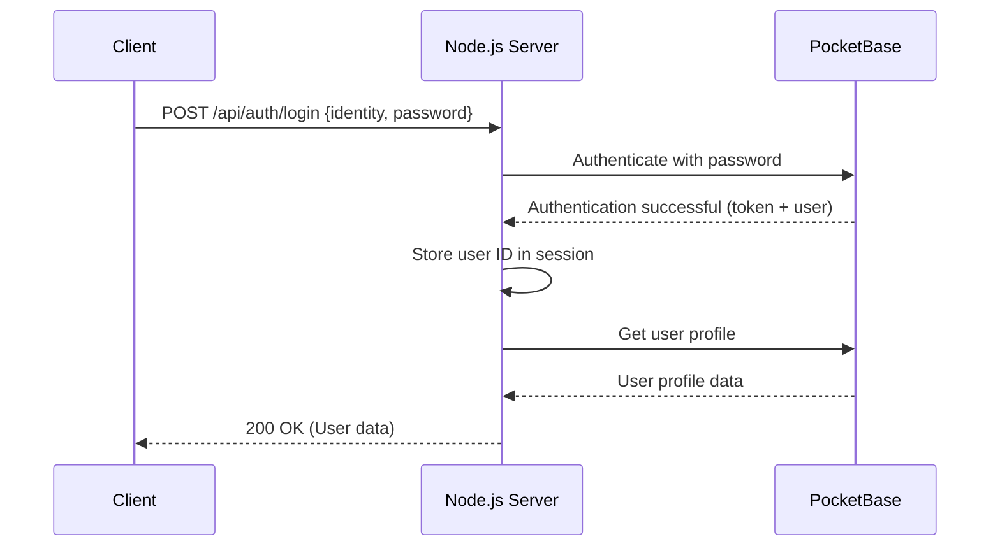
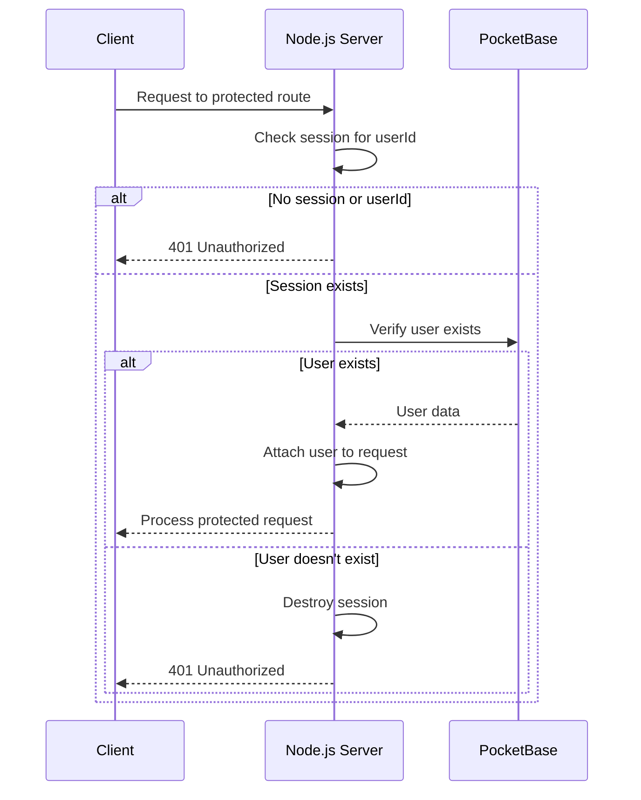
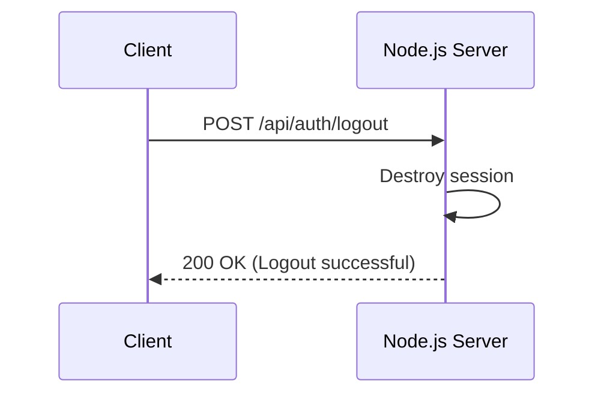
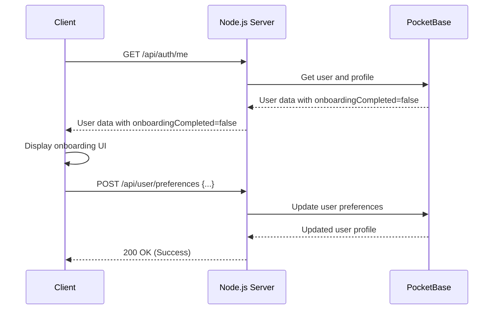

# Comprehensive PocketBase Authentication Guide for YouKOL Clone

This comprehensive guide outlines the complete authentication implementation for YouKOL Clone using PocketBase through a secure server-side approach. It covers architecture, server-side implementation, frontend integration, and post-authentication user experience.

## Table of Contents

1. [Architecture Overview](#architecture-overview)
2. [Authentication Flows](#authentication-flows)
3. [Server-Side Implementation](#server-side-implementation)
4. [Frontend Integration](#frontend-integration)
5. [UI Components](#ui-components)
6. [User Preference Collection](#user-preference-collection)
7. [Implementation Timeline](#implementation-timeline)
8. [Security Considerations](#security-considerations)

## Architecture Overview

YouKOL Clone uses a server-side authentication approach with the following architecture:

```
Client (Browser) <---> Node.js Server <---> PocketBase
```

In this architecture:
- The client never directly communicates with PocketBase
- The Node.js server manages all PocketBase interactions
- Authentication state is maintained via server-side sessions
- PocketBase auth tokens remain server-side only
- User sessions are managed with HTTP-only cookies

### Benefits of This Approach

1. **Improved Security**: Authentication tokens never exposed to client-side code
2. **Centralized Logic**: All authentication logic centralized in server
3. **Reduced Client Complexity**: Client doesn't need to manage token storage/refresh
4. **Better Control**: Server can implement additional security measures (rate limiting, etc.)
5. **Future Flexibility**: Can change backend auth provider without client changes

## Authentication Flows

### 1. Registration Flow



1. Client sends registration data to Node.js server
2. Server validates the input data
3. Server creates a user record in PocketBase
4. Server creates a user profile in PocketBase
5. Server returns success response to client (without tokens)

### 2. Login Flow



1. Client sends login credentials to Node.js server
2. Server authenticates with PocketBase
3. PocketBase returns auth data (including token)
4. Server stores user ID in session (not the token)
5. Server fetches additional user data (profile)
6. Server returns user data to client (without tokens)

### 3. Authentication Verification



1. Client makes request to a protected route
2. Server checks if user ID exists in session
3. If no session or user ID, return 401 Unauthorized
4. If session exists, verify user exists in PocketBase
5. If user exists, process the request
6. If user doesn't exist, destroy session and return 401

### 4. Logout Flow



1. Client sends logout request
2. Server destroys the session
3. Server returns success response

### 5. Post-Authentication Onboarding



1. Client checks authentication status after login
2. If user hasn't completed onboarding, client shows onboarding UI
3. User completes onboarding steps, selecting preferences
4. Client sends preferences to server
5. Server stores preferences in PocketBase
6. User continues to main application

## Server-Side Implementation

### 1. Server Setup

```javascript
// server.js
const express = require('express');
const session = require('express-session');
const cors = require('cors');
const PocketBase = require('pocketbase/cjs');

const app = express();
const PORT = process.env.PORT || 3000;

// Middleware
app.use(express.json());
app.use(cors({
  origin: process.env.CLIENT_URL || 'http://localhost:8080',
  credentials: true
}));

// Session configuration
app.use(session({
  secret: process.env.SESSION_SECRET || 'your-secret-key',
  resave: false,
  saveUninitialized: false,
  cookie: {
    secure: process.env.NODE_ENV === 'production',
    maxAge: 24 * 60 * 60 * 1000, // 24 hours
    httpOnly: true,
    sameSite: 'lax'
  }
}));

// Initialize PocketBase
const pb = new PocketBase(process.env.POCKETBASE_URL || 'http://127.0.0.1:8090');

// Import route handlers
const authRoutes = require('./routes/auth');
const presetRoutes = require('./routes/presets');
const enhancementRoutes = require('./routes/enhancements');
const userRoutes = require('./routes/user');

// Use routes
app.use('/api/auth', authRoutes(pb));
app.use('/api/presets', presetRoutes(pb));
app.use('/api/enhancements', enhancementRoutes(pb));
app.use('/api/user', userRoutes(pb));

// Serve static files in production
if (process.env.NODE_ENV === 'production') {
  app.use(express.static('public'));
}

// Start server
app.listen(PORT, () => {
  console.log(`Server running on port ${PORT}`);
});
```

### 2. PocketBase Service

```javascript
// services/pocketbase.js
const PocketBase = require('pocketbase/cjs');

class PocketBaseService {
  constructor() {
    this.pb = new PocketBase(process.env.POCKETBASE_URL || 'http://127.0.0.1:8090');
    
    // Optional: setup admin authentication if needed
    if (process.env.POCKETBASE_ADMIN_EMAIL && process.env.POCKETBASE_ADMIN_PASSWORD) {
      this.adminAuth();
    }
  }
  
  async adminAuth() {
    try {
      await this.pb.admins.authWithPassword(
        process.env.POCKETBASE_ADMIN_EMAIL,
        process.env.POCKETBASE_ADMIN_PASSWORD
      );
      console.log('Admin authenticated with PocketBase');
    } catch (error) {
      console.error('Failed to authenticate admin with PocketBase:', error);
    }
  }
  
  // User authentication methods
  async registerUser(userData) {
    return await this.pb.collection('users').create(userData);
  }
  
  async loginUser(identity, password) {
    // Determine if identity is email or username
    const authData = await this.pb.collection('users').authWithPassword(
      identity,
      password
    );
    return authData;
  }
  
  async getUserById(userId) {
    return await this.pb.collection('users').getOne(userId);
  }
  
  async createUserProfile(profileData) {
    return await this.pb.collection('user_profiles').create(profileData);
  }
  
  async getUserProfile(userId) {
    return await this.pb.collection('user_profiles').getFirstListItem(`user="${userId}"`);
  }
}

module.exports = new PocketBaseService();
```

### 3. Auth Middleware

```javascript
// middleware/auth.js
function authMiddleware(pb) {
  return async (req, res, next) => {
    if (!req.session.userId) {
      return res.status(401).json({ error: 'Unauthorized. Please log in.' });
    }

    try {
      // Check if we have a valid session for this user
      const user = await pb.collection('users').getOne(req.session.userId);
      req.user = user;
      next();
    } catch (error) {
      // If PocketBase can't find the user or the token is invalid
      req.session.destroy();
      return res.status(401).json({ error: 'Session expired. Please log in again.' });
    }
  };
}

module.exports = authMiddleware;
```

### 4. Authentication Routes

```javascript
// routes/auth.js
const express = require('express');
const router = express.Router();

function authRoutes(pb) {
  // Register route
  router.post('/register', async (req, res) => {
    try {
      const { email, password, passwordConfirm, username } = req.body;
      
      // Create user in PocketBase
      const user = await pb.collection('users').create({
        email,
        password,
        passwordConfirm,
        username
      });
      
      // Create user profile
      await pb.collection('user_profiles').create({
        user: user.id,
        display_name: username,
        bio: '',
        onboarding_completed: false
      });
      
      // Send success response (don't return token to client)
      res.status(201).json({
        success: true,
        user: {
          id: user.id,
          email: user.email,
          username: user.username
        }
      });
    } catch (error) {
      res.status(400).json({
        success: false,
        error: error.message || 'Registration failed'
      });
    }
  });
  
  // Login route
  router.post('/login', async (req, res) => {
    try {
      const { identity, password } = req.body;
      
      // Authenticate with PocketBase
      const authData = await pb.collection('users').authWithPassword(
        identity,
        password
      );
      
      // Store user ID in session
      req.session.userId = authData.record.id;
      
      // Get user profile
      const profile = await pb.collection('user_profiles').getFirstListItem(`user="${authData.record.id}"`);
      
      // Send response without tokens
      res.json({
        success: true,
        user: {
          id: authData.record.id,
          email: authData.record.email,
          username: authData.record.username,
          profile: {
            displayName: profile.display_name,
            bio: profile.bio,
            onboardingCompleted: profile.onboarding_completed
          }
        }
      });
    } catch (error) {
      res.status(400).json({
        success: false,
        error: error.message || 'Login failed'
      });
    }
  });
  
  // Logout route
  router.post('/logout', (req, res) => {
    req.session.destroy(err => {
      if (err) {
        return res.status(500).json({ error: 'Failed to logout' });
      }
      res.json({ success: true, message: 'Logged out successfully' });
    });
  });
  
  // Get current user
  router.get('/me', async (req, res) => {
    if (!req.session.userId) {
      return res.status(401).json({ error: 'Not authenticated' });
    }
    
    try {
      const user = await pb.collection('users').getOne(req.session.userId);
      const profile = await pb.collection('user_profiles').getFirstListItem(`user="${req.session.userId}"`);
      
      res.json({
        success: true,
        user: {
          id: user.id,
          email: user.email,
          username: user.username,
          profile: {
            displayName: profile.display_name,
            bio: profile.bio,
            onboardingCompleted: profile.onboarding_completed
          }
        }
      });
    } catch (error) {
      req.session.destroy();
      res.status(401).json({ error: 'Session expired' });
    }
  });
  
  // Password reset request
  router.post('/reset-password', async (req, res) => {
    try {
      const { email } = req.body;
      await pb.collection('users').requestPasswordReset(email);
      res.json({ success: true, message: 'Password reset email sent' });
    } catch (error) {
      res.status(400).json({
        success: false,
        error: error.message || 'Failed to send password reset email'
      });
    }
  });
  
  return router;
}

module.exports = authRoutes;
```

### 5. User Preferences Route

```javascript
// routes/user.js
const express = require('express');
const router = express.Router();
const authMiddleware = require('../middleware/auth');

function userRoutes(pb) {
  // Apply auth middleware to all user routes
  router.use(authMiddleware(pb));
  
  // Update user preferences
  router.post('/preferences', async (req, res, next) => {
    try {
      const { usageFrequency, contentTypes, onboardingCompleted } = req.body;
      
      // Get user profile
      const userProfiles = await pb.collection('user_profiles').getFullList({
        filter: `user="${req.user.id}"`
      });
      
      if (userProfiles.length === 0) {
        return res.status(404).json({
          success: false,
          error: 'User profile not found'
        });
      }
      
      const profileId = userProfiles[0].id;
      
      // Update profile
      const updatedProfile = await pb.collection('user_profiles').update(profileId, {
        usage_frequency: usageFrequency,
        content_types: JSON.stringify(contentTypes),
        onboarding_completed: onboardingCompleted
      });
      
      res.json({
        success: true,
        profile: updatedProfile
      });
    } catch (error) {
      next(error);
    }
  });
  
  return router;
}

module.exports = userRoutes;
```

## Frontend Integration

### 1. Auth State Management with Alpine.js

```javascript
// In main Alpine.js application state
function appState() {
  return {
    // Other app state properties
    
    // Authentication state
    auth: {
      user: null,
      isLoading: false,
      error: null,
      
      // Check if user is authenticated
      get isAuthenticated() {
        return !!this.user;
      },
      
      // Initialize authentication (called during app init)
      async initialize() {
        this.isLoading = true;
        try {
          const response = await fetch('/api/auth/me', {
            credentials: 'include'
          });
          const data = await response.json();
          
          if (data.success) {
            this.user = data.user;
          }
        } catch (error) {
          console.error('Failed to initialize auth:', error);
        } finally {
          this.isLoading = false;
        }
      },
      
      // Login method
      async login(identity, password) {
        this.isLoading = true;
        this.error = null;
        
        try {
          const response = await fetch('/api/auth/login', {
            method: 'POST',
            headers: { 'Content-Type': 'application/json' },
            body: JSON.stringify({ identity, password }),
            credentials: 'include'
          });
          
          const data = await response.json();
          
          if (!data.success) {
            throw new Error(data.error || 'Login failed');
          }
          
          this.user = data.user;
          return true;
        } catch (error) {
          this.error = error.message;
          return false;
        } finally {
          this.isLoading = false;
        }
      },
      
      // Register method
      async register(userData) {
        this.isLoading = true;
        this.error = null;
        
        try {
          const response = await fetch('/api/auth/register', {
            method: 'POST',
            headers: { 'Content-Type': 'application/json' },
            body: JSON.stringify(userData),
            credentials: 'include'
          });
          
          const data = await response.json();
          
          if (!data.success) {
            throw new Error(data.error || 'Registration failed');
          }
          
          return true;
        } catch (error) {
          this.error = error.message;
          return false;
        } finally {
          this.isLoading = false;
        }
      },
      
      // Logout method
      async logout() {
        this.isLoading = true;
        
        try {
          await fetch('/api/auth/logout', {
            method: 'POST',
            credentials: 'include'
          });
          
          this.user = null;
        } catch (error) {
          console.error('Logout error:', error);
        } finally {
          this.isLoading = false;
        }
      }
    }
  };
}
```

### 2. Integrating with App Initialization

```javascript
async function initApp() {
  // Existing initialization code
  
  // Initialize authentication
  await this.auth.initialize();
  
  // Route to onboarding if first login
  if (this.auth.isAuthenticated && !this.auth.user.profile.onboardingCompleted) {
    this.currentView = 'onboarding';
  }
}
```

### 3. Protected Routes/Features Pattern

```html
<!-- Example of protected feature -->
<div x-show="auth.isAuthenticated">
  <!-- User-specific features like saved presets -->
  <button @click="loadUserPresets()">My Presets</button>
</div>

<!-- Alternative for non-authenticated users -->
<div x-show="!auth.isAuthenticated">
  <button @click="showAuthModal = true">Login to Save Presets</button>
</div>
```

## UI Components

### 1. Authentication Modal

```html
<div x-show="showAuthModal" class="fixed inset-0 bg-black bg-opacity-50 z-50 flex items-center justify-center" @click.away="showAuthModal = false">
  <div class="bg-white rounded-lg shadow-xl w-full max-w-md p-6" @click.stop>
    <div class="flex justify-between items-center mb-6">
      <h3 class="text-xl font-bold text-gray-900" x-text="authMode === 'login' ? 'Sign In' : 'Create Account'"></h3>
      <button @click="showAuthModal = false" class="text-gray-400 hover:text-gray-500">
        <svg class="h-6 w-6" fill="none" viewBox="0 0 24 24" stroke="currentColor">
          <path stroke-linecap="round" stroke-linejoin="round" stroke-width="2" d="M6 18L18 6M6 6l12 12" />
        </svg>
      </button>
    </div>
    
    <!-- Login Form -->
    <div x-show="authMode === 'login'">
      <form @submit.prevent="handleLogin">
        <div class="mb-4">
          <label class="block text-gray-700 text-sm font-medium mb-2" for="identity">
            Email or Username
          </label>
          <input x-model="loginForm.identity" id="identity" type="text" class="w-full px-3 py-2 border border-gray-300 rounded-md focus:outline-none focus:ring-2 focus:ring-blue-500" required>
        </div>
        
        <div class="mb-6">
          <label class="block text-gray-700 text-sm font-medium mb-2" for="password">
            Password
          </label>
          <input x-model="loginForm.password" id="password" type="password" class="w-full px-3 py-2 border border-gray-300 rounded-md focus:outline-none focus:ring-2 focus:ring-blue-500" required>
        </div>
        
        <button type="submit" class="w-full py-2 px-4 bg-blue-600 hover:bg-blue-700 text-white font-medium rounded-md focus:outline-none focus:ring-2 focus:ring-blue-500" :disabled="auth.isLoading">
          <span x-show="!auth.isLoading">Sign In</span>
          <span x-show="auth.isLoading">
            <svg class="animate-spin h-5 w-5 mx-auto" xmlns="http://www.w3.org/2000/svg" fill="none" viewBox="0 0 24 24">
              <circle class="opacity-25" cx="12" cy="12" r="10" stroke="currentColor" stroke-width="4"></circle>
              <path class="opacity-75" fill="currentColor" d="M4 12a8 8 0 018-8V0C5.373 0 0 5.373 0 12h4zm2 5.291A7.962 7.962 0 014 12H0c0 3.042 1.135 5.824 3 7.938l3-2.647z"></path>
            </svg>
          </span>
        </button>
        
        <p x-show="auth.error" class="mt-3 text-sm text-red-600" x-text="auth.error"></p>
      </form>
      
      <div class="mt-4 text-center">
        <p class="text-sm text-gray-600">
          Don't have an account?
          <button @click="authMode = 'register'; auth.error = null" class="text-blue-600 hover:underline">
            Create one
          </button>
        </p>
      </div>
    </div>
    
    <!-- Registration Form -->
    <div x-show="authMode === 'register'">
      <form @submit.prevent="handleRegister">
        <div class="mb-4">
          <label class="block text-gray-700 text-sm font-medium mb-2" for="username">
            Username
          </label>
          <input x-model="registerForm.username" id="username" type="text" class="w-full px-3 py-2 border border-gray-300 rounded-md focus:outline-none focus:ring-2 focus:ring-blue-500" required>
        </div>
        
        <div class="mb-4">
          <label class="block text-gray-700 text-sm font-medium mb-2" for="email">
            Email
          </label>
          <input x-model="registerForm.email" id="email" type="email" class="w-full px-3 py-2 border border-gray-300 rounded-md focus:outline-none focus:ring-2 focus:ring-blue-500" required>
        </div>
        
        <div class="mb-4">
          <label class="block text-gray-700 text-sm font-medium mb-2" for="reg-password">
            Password
          </label>
          <input x-model="registerForm.password" id="reg-password" type="password" class="w-full px-3 py-2 border border-gray-300 rounded-md focus:outline-none focus:ring-2 focus:ring-blue-500" required>
        </div>
        
        <div class="mb-6">
          <label class="block text-gray-700 text-sm font-medium mb-2" for="password-confirm">
            Confirm Password
          </label>
          <input x-model="registerForm.passwordConfirm" id="password-confirm" type="password" class="w-full px-3 py-2 border border-gray-300 rounded-md focus:outline-none focus:ring-2 focus:ring-blue-500" required>
        </div>
        
        <button type="submit" class="w-full py-2 px-4 bg-blue-600 hover:bg-blue-700 text-white font-medium rounded-md focus:outline-none focus:ring-2 focus:ring-blue-500" :disabled="auth.isLoading">
          <span x-show="!auth.isLoading">Create Account</span>
          <span x-show="auth.isLoading">
            <svg class="animate-spin h-5 w-5 mx-auto" xmlns="http://www.w3.org/2000/svg" fill="none" viewBox="0 0 24 24">
              <circle class="opacity-25" cx="12" cy="12" r="10" stroke="currentColor" stroke-width="4"></circle>
              <path class="opacity-75" fill="currentColor" d="M4 12a8 8 0 018-8V0C5.373 0 0 5.373 0 12h4zm2 5.291A7.962 7.962 0 014 12H0c0 3.042 1.135 5.824 3 7.938l3-2.647z"></path>
            </svg>
          </span>
        </button>
        
        <p x-show="auth.error" class="mt-3 text-sm text-red-600" x-text="auth.error"></p>
      </form>
      
      <div class="mt-4 text-center">
        <p class="text-sm text-gray-600">
          Already have an account?
          <button @click="authMode = 'login'; auth.error = null" class="text-blue-600 hover:underline">
            Sign in
          </button>
        </p>
      </div>
    </div>
  </div>
</div>
```

### 2. Authentication Controller Logic

```javascript
// Authentication variables and handlers to add to appState
authMode: 'login',
showAuthModal: false,
loginForm: {
  identity: '',
  password: ''
},
registerForm: {
  username: '',
  email: '',
  password: '',
  passwordConfirm: ''
},

// Login handler
async handleLogin() {
  const success = await this.auth.login(
    this.loginForm.identity,
    this.loginForm.password
  );
  
  if (success) {
    this.showAuthModal = false;
    this.loginForm.identity = '';
    this.loginForm.password = '';
    
    // Check if onboarding is needed
    if (!this.auth.user.profile.onboardingCompleted) {
      this.currentView = 'onboarding';
    }
  }
},

// Registration handler
async handleRegister() {
  // Validate password match
  if (this.registerForm.password !== this.registerForm.passwordConfirm) {
    this.auth.error = 'Passwords do not match';
    return;
  }
  
  const success = await this.auth.register({
    username: this.registerForm.username,
    email: this.registerForm.email,
    password: this.registerForm.password,
    passwordConfirm: this.registerForm.passwordConfirm
  });
  
  if (success) {
    // Switch to login form
    this.authMode = 'login';
    this.loginForm.identity = this.registerForm.email;
    
    // Clear registration form
    this.registerForm.username = '';
    this.registerForm.email = '';
    this.registerForm.password = '';
    this.registerForm.passwordConfirm = '';
  }
}
```

## User Preference Collection

After authentication is implemented, the next step is to collect user preferences through a guided onboarding process, similar to platforms like Twitter and YouTube Music.

### 1. PocketBase Schema Extensions

```javascript
// Fields to add to user_profiles collection
{
  "onboarding_completed": {
    "type": "bool",
    "default": false
  },
  "usage_frequency": {
    "type": "text",
    "options": {
      "values": ["daily", "weekly", "monthly", "rarely"]
    }
  },
  "content_types": {
    "type": "json"
  },
  "last_used_preset": {
    "type": "relation",
    "options": {
      "collectionId": "enhancement_presets",
      "cascadeDelete": false
    }
  }
}
```

### 2. Onboarding UI Component

```html
<div x-show="currentView === 'onboarding'" class="fixed inset-0 bg-white z-50">
  <div class="max-w-3xl mx-auto px-4 py-8">
    <!-- Header with progress -->
    <div class="mb-8">
      <div class="flex justify-between items-center">
        <h2 class="text-2xl font-bold">Customize Your Experience</h2>
        <div class="text-sm text-gray-500">
          Step <span x-text="onboardingStep"></span> of <span x-text="totalOnboardingSteps"></span>
        </div>
      </div>
      
      <!-- Progress bar -->
      <div class="w-full bg-gray-200 rounded-full h-2 mt-4">
        <div class="bg-blue-600 h-2 rounded-full transition-all duration-300" :style="`width: ${(onboardingStep / totalOnboardingSteps) * 100}%`"></div>
      </div>
    </div>
    
    <!-- Step 1: Enhancement Preferences -->
    <div x-show="onboardingStep === 1" class="onboarding-step">
      <h3 class="text-xl font-semibold mb-6">What types of enhancements are you interested in?</h3>
      <p class="text-gray-600 mb-8">Select all that apply. This helps us create your default enhancement preset.</p>
      
      <div class="grid grid-cols-2 md:grid-cols-3 gap-4">
        <template x-for="option in enhancementOptions" :key="option.id">
          <div 
            @click="toggleEnhancementPreference(option.id)"
            :class="userPreferences.enhancements.includes(option.id) ? 'bg-blue-50 border-blue-500' : 'bg-white border-gray-300'"
            class="border-2 rounded-lg p-4 cursor-pointer transition-colors hover:bg-gray-50"
          >
            <div class="flex items-center justify-between">
              <span x-text="option.name" class="font-medium"></span>
              <svg 
                x-show="userPreferences.enhancements.includes(option.id)"
                class="w-5 h-5 text-blue-600" 
                fill="currentColor" 
                viewBox="0 0 20 20" 
                xmlns="http://www.w3.org/2000/svg"
              >
                <path fill-rule="evenodd" d="M10 18a8 8 0 100-16 8 8 0 000 16zm3.707-9.293a1 1 0 00-1.414-1.414L9 10.586 7.707 9.293a1 1 0 00-1.414 1.414l2 2a1 1 0 001.414 0l4-4z" clip-rule="evenodd"></path>
              </svg>
            </div>
            <p x-text="option.description" class="text-sm text-gray-500 mt-2"></p>
          </div>
        </template>
      </div>
    </div>
    
    <!-- Step 2: Usage Frequency -->
    <div x-show="onboardingStep === 2" class="onboarding-step">
      <h3 class="text-xl font-semibold mb-6">How often do you plan to use YouKOL Clone?</h3>
      
      <div class="space-y-4">
        <template x-for="option in frequencyOptions" :key="option.id">
          <div 
            @click="userPreferences.usageFrequency = option.id"
            :class="userPreferences.usageFrequency === option.id ? 'bg-blue-50 border-blue-500' : 'bg-white border-gray-300'"
            class="border-2 rounded-lg p-4 cursor-pointer transition-colors hover:bg-gray-50"
          >
            <div class="flex items-center">
              <div :class="userPreferences.usageFrequency === option.id ? 'border-blue-600 bg-blue-600' : 'border-gray-300 bg-white'" class="w-5 h-5 rounded-full border flex-shrink-0 mr-3">
                <div x-show="userPreferences.usageFrequency === option.id" class="w-3 h-3 bg-white rounded-full m-1"></div>
              </div>
              <span x-text="option.label" class="font-medium"></span>
            </div>
          </div>
        </template>
      </div>
    </div>
    
    <!-- Step 3: Content Types -->
    <div x-show="onboardingStep === 3" class="onboarding-step">
      <h3 class="text-xl font-semibold mb-6">What type of content do you typically create?</h3>
      <p class="text-gray-600 mb-8">This helps us tailor your enhancement settings.</p>
      
      <div class="grid grid-cols-2 md:grid-cols-3 gap-4">
        <template x-for="option in contentTypeOptions" :key="option.id">
          <div 
            @click="toggleContentTypePreference(option.id)"
            :class="userPreferences.contentTypes.includes(option.id) ? 'bg-blue-50 border-blue-500' : 'bg-white border-gray-300'"
            class="border-2 rounded-lg p-4 cursor-pointer transition-colors hover:bg-gray-50"
          >
            <div class="flex items-center justify-between">
              <span x-text="option.name" class="font-medium"></span>
              <svg 
                x-show="userPreferences.contentTypes.includes(option.id)"
                class="w-5 h-5 text-blue-600" 
                fill="currentColor" 
                viewBox="0 0 20 20" 
                xmlns="http://www.w3.org/2000/svg"
              >
                <path fill-rule="evenodd" d="M10 18a8 8 0 100-16 8 8 0 000 16zm3.707-9.293a1 1 0 00-1.414-1.414L9 10.586 7.707 9.293a1 1 0 00-1.414 1.414l2 2a1 1 0 001.414 0l4-4z" clip-rule="evenodd"></path>
              </svg>
            </div>
          </div>
        </template>
      </div>
    </div>
    
    <!-- Navigation buttons -->
    <div class="mt-12 flex justify-between">
      <button 
        x-show="onboardingStep > 1"
        @click="onboardingStep--"
        class="px-6 py-2 border border-gray-300 rounded-md text-gray-700 hover:bg-gray-50"
      >
        Back
      </button>
      
      <div class="ml-auto">
        <button 
          x-show="onboardingStep < totalOnboardingSteps"
          @click="onboardingStep++"
          class="px-6 py-2 bg-blue-600 text-white rounded-md hover:bg-blue-700"
        >
          Continue
        </button>
        
        <button 
          x-show="onboardingStep === totalOnboardingSteps"
          @click="completeOnboarding"
          class="px-6 py-2 bg-blue-600 text-white rounded-md hover:bg-blue-700"
          :disabled="isSubmittingPreferences"
        >
          <span x-show="!isSubmittingPreferences">Get Started</span>
          <span x-show="isSubmittingPreferences">
            <svg class="animate-spin h-5 w-5 mx-auto" xmlns="http://www.w3.org/2000/svg" fill="none" viewBox="0 0 24 24">
              <circle class="opacity-25" cx="12" cy="12" r="10" stroke="currentColor" stroke-width="4"></circle>
              <path class="opacity-75" fill="currentColor" d="M4 12a8 8 0 018-8V0C5.373 0 0 5.373 0 12h4zm2 5.291A7.962 7.962 0 014 12H0c0 3.042 1.135 5.824 3 7.938l3-2.647z"></path>
            </svg>
          </span>
        </button>
      </div>
    </div>
  </div>
</div>
```

### 3. Onboarding State Management

```javascript
// Add to appState
onboardingStep: 1,
totalOnboardingSteps: 3,
isSubmittingPreferences: false,
userPreferences: {
  enhancements: [],
  usageFrequency: null,
  contentTypes: []
},

// Enhancement options
enhancementOptions: [
  { id: 'color_correction', name: 'Color Correction', description: 'Improve color balance and saturation' },
  { id: 'sharpening', name: 'Sharpening', description: 'Enhance detail and clarity' },
  { id: 'noise_reduction', name: 'Noise Reduction', description: 'Remove grain and digital noise' },
  { id: 'contrast', name: 'Contrast Enhancement', description: 'Improve light and dark balance' },
  { id: 'hdr', name: 'HDR Effect', description: 'Add dynamic range to flat images' },
  { id: 'portrait', name: 'Portrait Enhancement', description: 'Improve facial features and skin tones' }
],

// Frequency options
frequencyOptions: [
  { id: 'daily', label: 'Daily - It will be part of my workflow' },
  { id: 'weekly', label: 'Weekly - For regular projects' },
  { id: 'monthly', label: 'Monthly - For occasional needs' },
  { id: 'rarely', label: 'Rarely - Just when needed' }
],

// Content type options
contentTypeOptions: [
  { id: 'social_media', name: 'Social Media' },
  { id: 'professional', name: 'Professional Work' },
  { id: 'portfolio', name: 'Portfolio' },
  { id: 'personal', name: 'Personal Photos' },
  { id: 'products', name: 'Product Photography' },
  { id: 'landscape', name: 'Landscape Photography' },
  { id: 'portraits', name: 'Portraits' },
  { id: 'other', name: 'Other' }
],

// Toggle enhancement preference
toggleEnhancementPreference(id) {
  if (this.userPreferences.enhancements.includes(id)) {
    this.userPreferences.enhancements = this.userPreferences.enhancements.filter(e => e !== id);
  } else {
    this.userPreferences.enhancements.push(id);
  }
},

// Toggle content type preference
toggleContentTypePreference(id) {
  if (this.userPreferences.contentTypes.includes(id)) {
    this.userPreferences.contentTypes = this.userPreferences.contentTypes.filter(t => t !== id);
  } else {
    this.userPreferences.contentTypes.push(id);
  }
},

// Complete onboarding
async completeOnboarding() {
  this.isSubmittingPreferences = true;
  
  try {
    // Create a default preset based on user preferences
    const enhancementSettings = this.userPreferences.enhancements.map(enhancement => ({
      type: enhancement,
      intensity: 50, // Default middle intensity
      enabled: true
    }));
    
    // Save to PocketBase through server API
    const response = await fetch('/api/presets', {
      method: 'POST',
      headers: { 'Content-Type': 'application/json' },
      body: JSON.stringify({
        name: 'My Default Preset',
        isDefault: true,
        settings: enhancementSettings
      }),
      credentials: 'include'
    });
    
    // Save user profile preferences
    await fetch('/api/user/preferences', {
      method: 'POST',
      headers: { 'Content-Type': 'application/json' },
      body: JSON.stringify({
        usageFrequency: this.userPreferences.usageFrequency,
        contentTypes: this.userPreferences.contentTypes,
        onboardingCompleted: true
      }),
      credentials: 'include'
    });
    
    // Update user profile in state
    this.auth.user.profile.onboardingCompleted = true;
    
    // Return to main app
    this.currentView = 'main';
  } catch (error) {
    console.error('Failed to save preferences:', error);
  } finally {
    this.isSubmittingPreferences = false;
  }
}
```

## Implementation Timeline

1. **Phase 1: Authentication Infrastructure (1-2 weeks)**
   - Implement server-side authentication endpoints
   - Create authentication UI components
   - Integrate authentication with app state
   - Test authentication flow

2. **Phase 2: User Preference Collection (1-2 weeks)**
   - Extend PocketBase schema for user preferences
   - Implement onboarding UI
   - Create API endpoints for preference storage
   - Test preference collection flow

3. **Phase 3: Preference-based Features (2-3 weeks)**
   - Create default enhancement presets based on preferences
   - Implement preset loading and application
   - Add personalized recommendations
   - Build preference-based UI customizations

4. **Phase 4: Refinement and Optimization (1 week)**
   - Usability testing and feedback collection
   - UI/UX improvements
   - Performance optimization
   - Documentation updates

## Security Considerations

1. **Token Management**
   - PocketBase tokens never leave the server
   - No tokens are stored in localStorage or cookies on client
   - Server maintains session state using secure, HTTP-only cookies

2. **Session Security**
   - Session cookies are set with:
     - `httpOnly: true` - Cannot be accessed via JavaScript
     - `secure: true` in production - Only sent over HTTPS
     - `sameSite: 'lax'` - Protects against CSRF

3. **CSRF Protection**
   - For mutating operations, consider implementing CSRF tokens
   - Validate Origin/Referer headers for additional protection

4. **Rate Limiting**
   - Implement rate limiting on authentication endpoints
   - Apply IP-based and account-based rate limiting

5. **Error Handling**
   - Consistent error response format
   - Avoid exposing sensitive information in error messages
   - Log authentication failures with appropriate context 