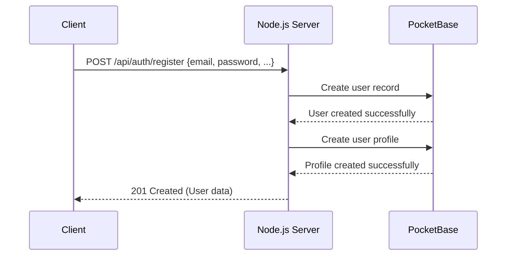
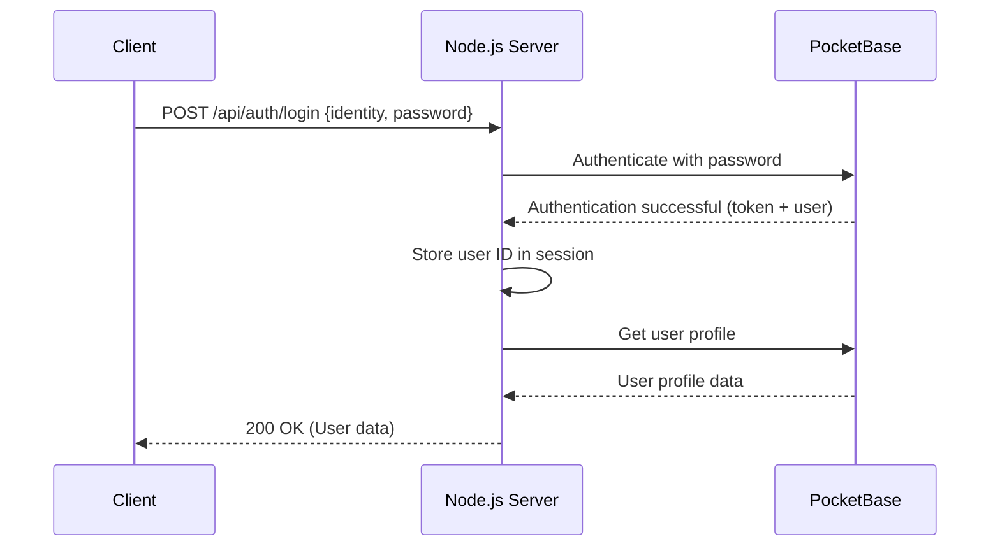
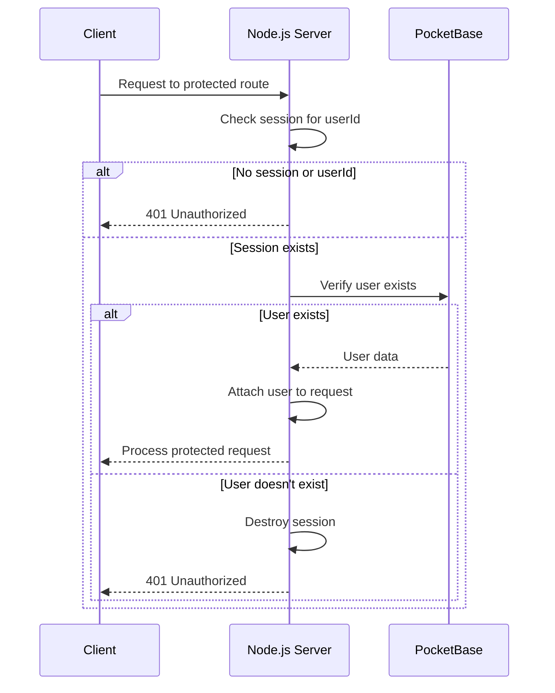
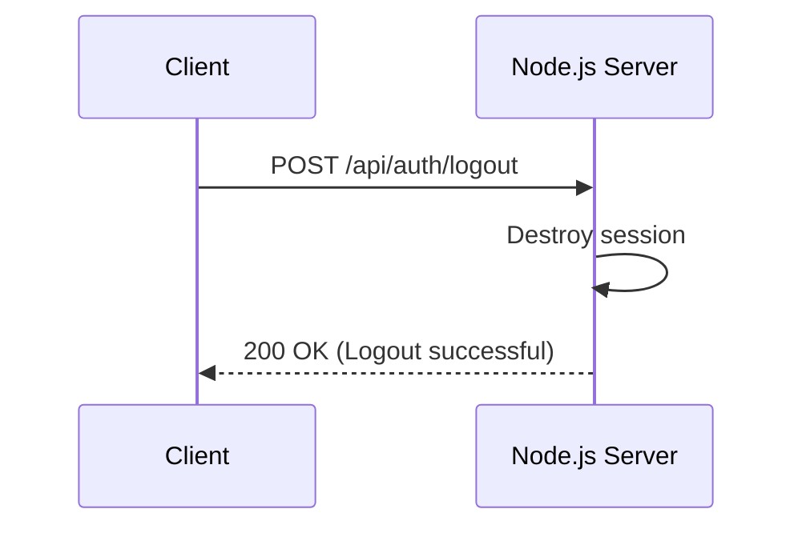

# Server-Side Authentication Flow

This document explains the authentication flow when using a Node.js server as a proxy between the client and PocketBase.

## Architecture Overview

```
Client <---> Node.js Server <---> PocketBase
```

In this architecture:
- The client never directly communicates with PocketBase
- The Node.js server manages all PocketBase interactions
- Authentication state is maintained via server-side sessions
- PocketBase auth tokens remain server-side only

## Authentication Flow

### 1. Registration Flow



1. Client sends registration data to Node.js server
2. Server validates the input data
3. Server creates a user record in PocketBase
4. Server creates a user profile in PocketBase
5. Server returns success response to client (without tokens)

### 2. Login Flow



1. Client sends login credentials to Node.js server
2. Server authenticates with PocketBase
3. PocketBase returns auth data (including token)
4. Server stores user ID in session (not the token)
5. Server fetches additional user data (profile)
6. Server returns user data to client (without tokens)

### 3. Authentication Verification



1. Client makes request to a protected route
2. Server checks if user ID exists in session
3. If no session or user ID, return 401 Unauthorized
4. If session exists, verify user exists in PocketBase
5. If user exists, process the request
6. If user doesn't exist, destroy session and return 401

### 4. Logout Flow



1. Client sends logout request
2. Server destroys the session
3. Server returns success response

## Security Considerations

### 1. Token Management

- PocketBase tokens never leave the server
- No tokens are stored in localStorage or cookies on client
- Server maintains session state using secure, HTTP-only cookies

### 2. Session Security

- Session cookies are set with:
  - `httpOnly: true` - Cannot be accessed via JavaScript
  - `secure: true` in production - Only sent over HTTPS
  - `sameSite: 'lax'` - Protects against CSRF

### 3. CSRF Protection

- For mutating operations, consider implementing CSRF tokens
- Validate Origin/Referer headers for additional protection

### 4. Rate Limiting

- Implement rate limiting on authentication endpoints to prevent brute force attempts
- Apply IP-based and account-based rate limiting

## Error Handling

Common authentication errors and their handling:

| Error Type | Status Code | Response |
|------------|-------------|----------|
| Invalid credentials | 400 | `{success: false, error: 'Invalid credentials'}` |
| Session expired | 401 | `{success: false, error: 'Session expired'}` |
| Access denied | 403 | `{success: false, error: 'Access denied'}` |
| Rate limited | 429 | `{success: false, error: 'Too many requests'}` |

## Client Integration

The client interacts with the Node.js server's authentication endpoints:

```javascript
// Example client login code
async function login(identity, password) {
  try {
    const response = await fetch('/api/auth/login', {
      method: 'POST',
      headers: { 'Content-Type': 'application/json' },
      body: JSON.stringify({ identity, password }),
      credentials: 'include'  // Important for cookies!
    });
    
    const data = await response.json();
    
    if (!data.success) {
      throw new Error(data.error || 'Login failed');
    }
    
    return data.user;
  } catch (error) {
    console.error('Login error:', error);
    throw error;
  }
}
```

## Benefits of This Approach

1. **Improved Security**: Authentication tokens never exposed to client-side code
2. **Centralized Logic**: All authentication logic centralized in server
3. **Reduced Client Complexity**: Client doesn't need to manage token storage/refresh
4. **Better Control**: Server can implement additional security measures (rate limiting, etc.)
5. **Future Flexibility**: Can change backend auth provider without client changes 